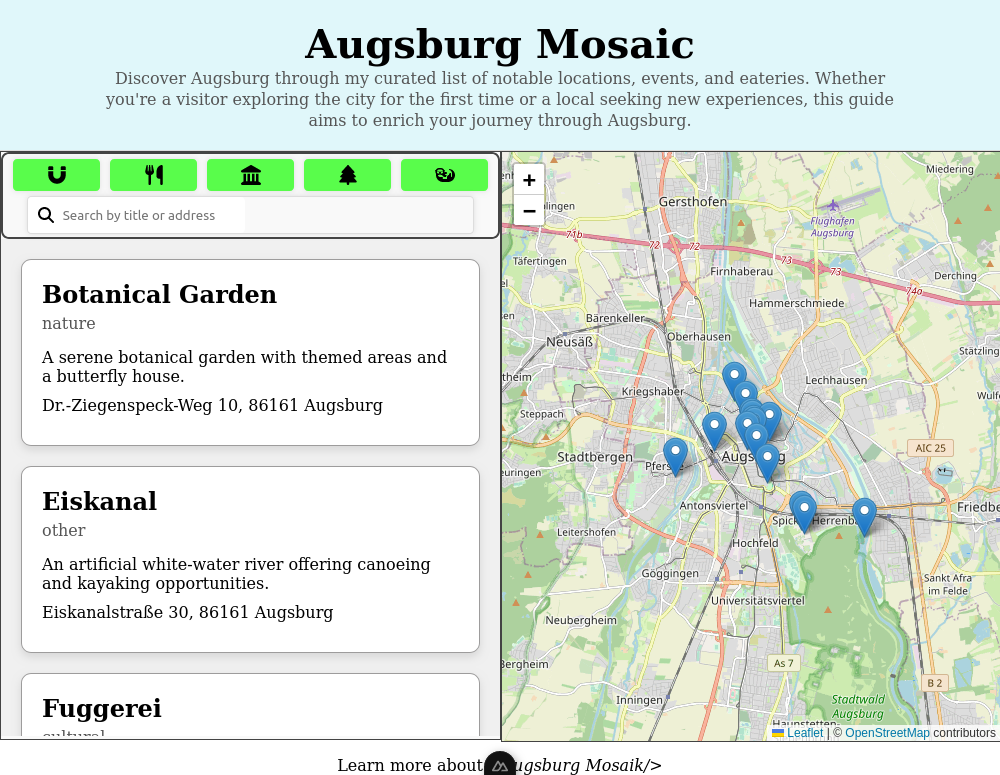

# Augsburg Mosaic

This project blossomed from a genuine fondness for the city of Augsburg, aiming to unfold its hidden gems and notable locales to both visitors and residents alike.



## Project Overview

Augsburg Mosaic serves as a digital guide, offering a curated list of places categorized as Attractions, Food spots, Cultural hubs, Nature retreats, and Others. Through an interactive map and a user-friendly list, one can explore, filter, and learn more about each location.

Utilizing technologies such as Vue.js, Nuxt.js, Leaflet.js for map rendering, and Pinia for state management, this project embodies a seamless blend of design and functionality, all while being a purely static site optimized for SEO. This also means, there are no cookies or any other data collection mechanisms involved, especially not concerning personal data.

This endeavor is purely a hobby, unfunded yet rich in spirit. The icons embellishing this site are courtesy of FontAwesome, while the images are captured through the lens of [WieErWill](https://wieerwill.de).

## Getting Started

### Prerequisites

- Ensure you have [Node.js](https://nodejs.org/) installed on your machine.
- This project uses [pnpm](https://pnpm.io/) as the package manager. Install it globally using `npm install -g pnpm`.

### Setup

1. Fork this repository to your GitHub account.
2. Clone your forked repository to your local machine: `git clone https://github.com/wieerwill/augsburg-mosaic.git`
3. Navigate to the project directory: `cd augsburg-mosaic`
4. Install the project dependencies: `pnpm install`
5. Start the development server: `pnpm dev`

The project should now be running on [http://localhost:3000](http://localhost:3000).

### Building

To build the static version of the project, run:

```bash
pnpm generate
```

The static files will be generated in the dist directory, ready to be deployed.
Contributing

Feel free to explore, report issues, or open pull requests. If you find this project useful, please consider giving it a star! ⭐

### License

This project is open-source and available under the MIT License.

### Acknowledgements

Icons provided by FontAwesome.

Map rendering powered by Leaflet.js.

Enjoy traversing through the mosaic of Augsburg!